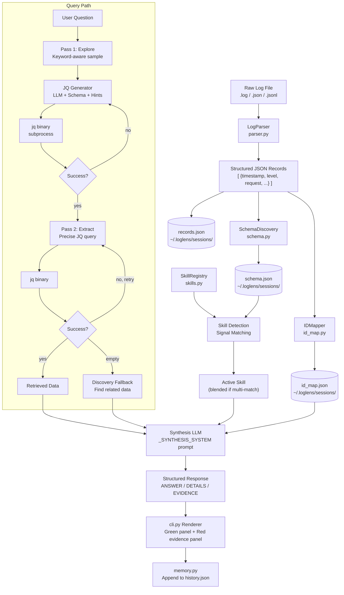
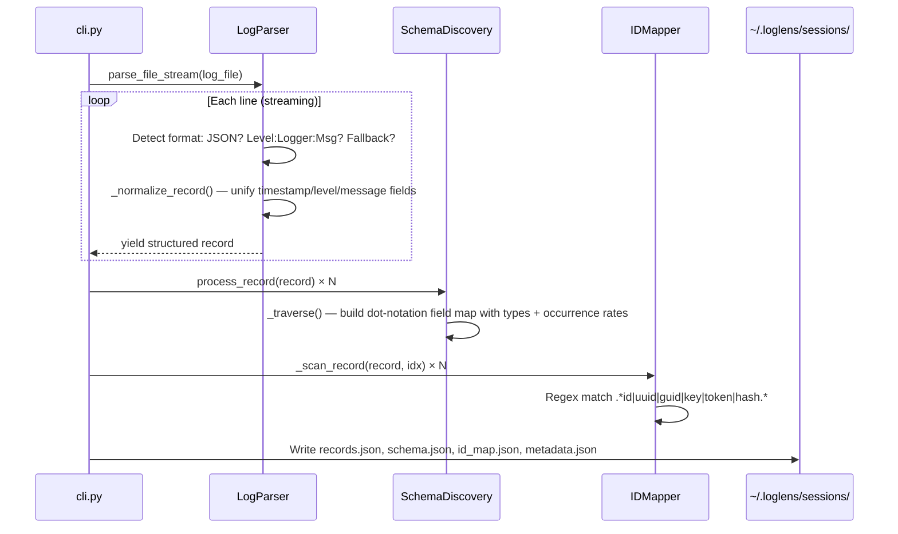
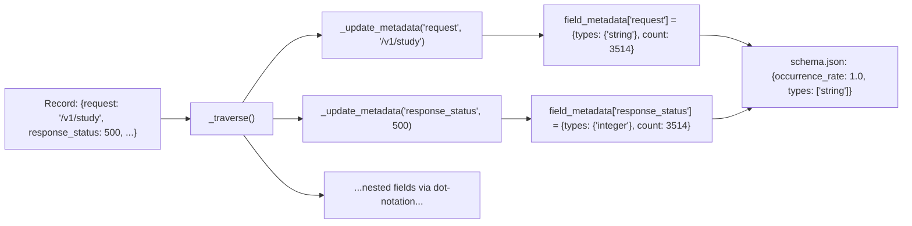
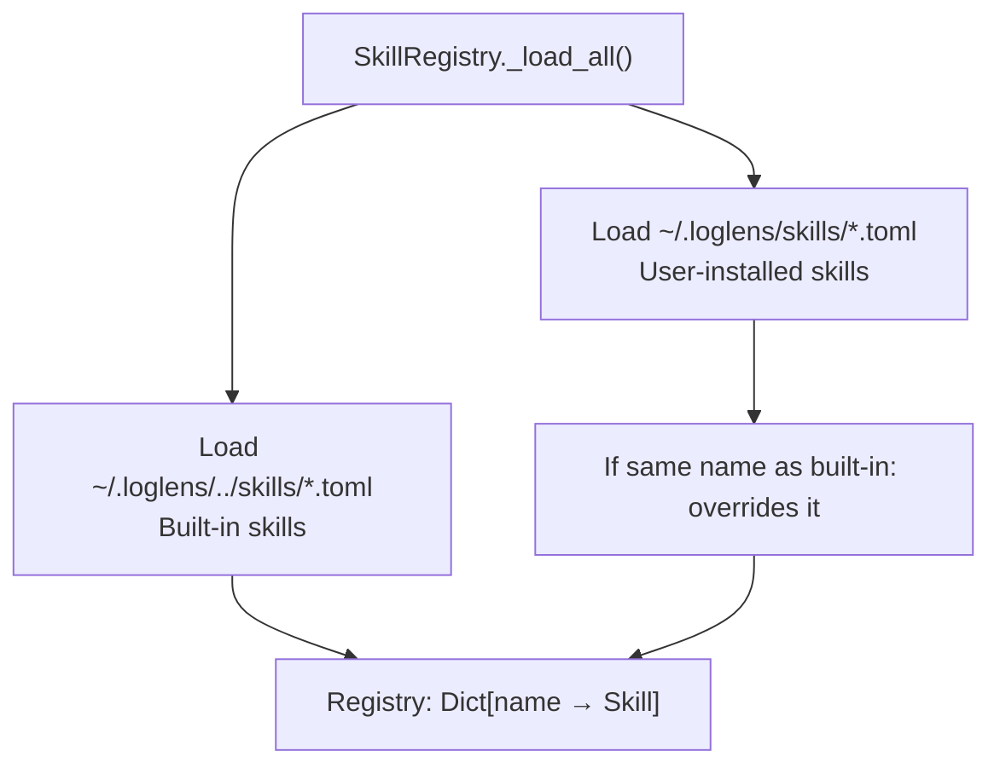
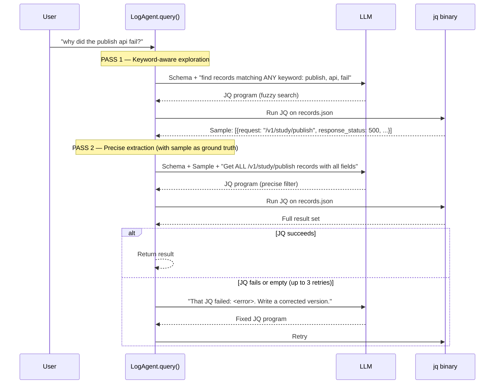
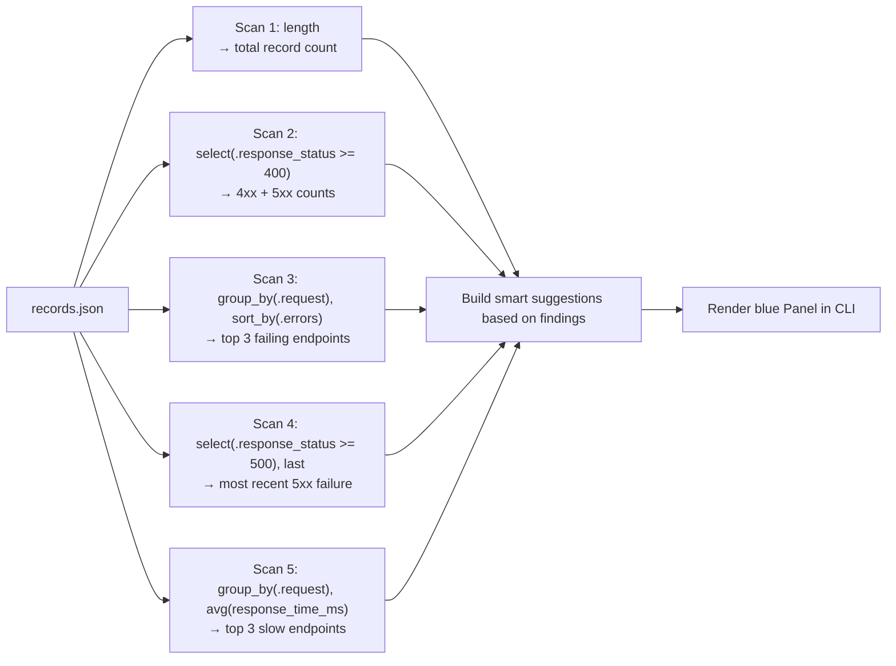
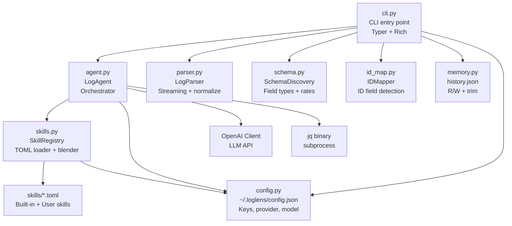
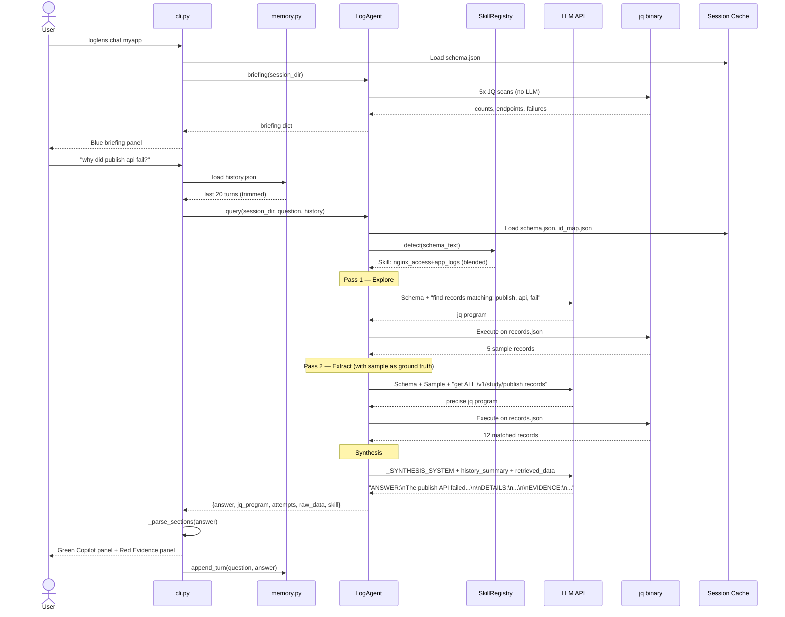

# How LogLens Works: A Deep Dive into Vectorless RAG for Log Intelligence

> A technical walkthrough of every layer of the LogLens pipeline — from raw bytes to evidence-backed answers — sourced directly from the codebase.

---

## The Problem With Logs

Logs are the most underused source of truth in any engineering organization. They contain exact timestamps, correlation IDs, error traces, HTTP status codes, and response latencies — yet extracting insight from them typically requires:

- Manual `grep` patterns that miss context
- An ELK or Splunk stack that costs a team weeks to set up
- LLM-based RAG systems that chunk logs like documents and retrieve "similar" text — which completely breaks for analytical questions like *"what was the 99th percentile latency for /v1/study?"*

LogLens takes a different approach: **treat logs as structured data, not documents**.

---

## The Core Thesis: Vectorless RAG

Traditional RAG (Retrieval-Augmented Generation) retrieves chunks of text by semantic similarity and hands them to an LLM. For log analysis, this fails in three fundamental ways:

| Query Type | Traditional RAG | LogLens |
|---|---|---|
| "How many 500 errors?" | Retrieves chunks *mentioning* errors, LLM guesses | JQ counts exactly: `map(select(.response_status >= 500)) | length` |
| "Which endpoint is slowest?" | No way to aggregate across all records | JQ groups and averages: `group_by(.request) | map({ep: .[0].request, avg: ...})` |
| "What failed at 14:32?" | Semantic similarity on timestamps doesn't work | JQ filters by ISO 8601 string range: `select(.timestamp >= "...")` |
| Hallucination risk | LLM fills gaps with plausible fiction | Evidence panel shows verbatim source lines |

Instead of embedding-based retrieval, LogLens uses the LLM as a **programmer**: given a schema and a question, it writes a `jq` program that executes deterministically on the actual data. The result is exact.

---

## System Overview



---

## Phase 1: Ingestion Pipeline

When you run `loglens ingest /var/log/nginx/access.log`, four sequential operations happen:



### 1a. Log Parsing (`parser.py`)

`LogParser.parse_file_stream()` is a generator — it yields records one at a time rather than loading the whole file. This means it can handle files of any size.

It handles three formats in priority order:

```
Line received
     │
     ├─── Starts with `{` ?  ──────► JSON Mode
     │                                  Buffer until valid JSON decodes
     │                                  _normalize_record() to unify field names
     │
     ├─── Matches LEVEL:LOGGER:MSG ?  ─► Plaintext Mode
     │                                  Handle multiline (e.g. Python tracebacks)
     │
     └─── Otherwise  ─────────────────► Unknown fallback
                                        Assign level=UNKNOWN, try timestamp extraction
```

**Normalization (`_normalize_record`):** After parsing, every record is normalized so downstream code always finds the same field names regardless of the original log format:

| Canonical Field | Accepted Source Fields |
|---|---|
| `timestamp` | `written_at`, `time`, `ts`, `@timestamp` |
| `level` | `severity`, `log_level`, `priority` |
| `message` | `msg`, `log`, `text` |

Timestamp extraction uses three regex patterns in priority order: ISO 8601, Common Log Format (`15/Jan/2024:10:32:00 +0000`), and simple date-time (`2024-04-29 16:49:21`).

### 1b. Schema Discovery (`schema.py`)

`SchemaDiscovery` makes a single streaming pass over all records to build a structural map of every field in the dataset.



The output for each field includes:
- **`types`** — set of Python type names seen (`string`, `integer`, `float`, `boolean`, `null`, `array`, `object`)
- **`occurrence_rate`** — fraction of records that have this field (e.g., `0.87` = present in 87% of records)

This is exactly what the LLM receives when asked to write a JQ query. It tells the LLM which fields exist, what type they are, and how common they are — without exposing any actual data values.

### 1c. ID Map Building (`id_map.py`)

`IDMapper` scans every record for fields that look like IDs using a regex: `.*id|uuid|guid|key|token|hash.*`.

For each match, it records:
- A global `id_map`: `{ "uuid-value-here": [record_indices...] }` — which records share this ID
- A `field_to_ids`: `{ "correlation_id": {"uuid1", "uuid2", ...} }` — which IDs appeared in which field

This enables cross-record correlation. When the LLM asks "what other events share correlation_id X?", LogLens can link them without re-scanning.

---

## Phase 2: The Skill System (`skills.py`)

Before any LLM call, LogLens must determine the **domain context** — the vocabulary and rules specific to this type of log. This is the job of the Skills System.

### How Skills Are Loaded



Priority order: **User skills > Built-in skills > Generic fallback**

### Skill Detection: Signal Scoring

When a query arrives, `SkillRegistry.detect(schema_text)` scores every non-fallback skill:

```python
score = sum(1 for sig in skill.signals if sig.lower() in schema_text.lower())
```

This is pure substring matching — no LLM needed. A skill with signals `["response_status", "request", "method"]` scores 3 if the schema contains all three fields.

### Skill Blending

This is one of the more interesting design decisions. Real-world logs are often **hybrid** — for example, a Node.js app that also logs HTTP request details will have both `level`/`logger` fields (app_logs skill) and `response_status`/`request` fields (nginx_access skill).

The blending algorithm:

```
top_score = highest score across all skills

for each skill:
    if skill.score >= top_score * 0.5:   ← BLEND_THRESHOLD
        include in blend

if len(blended) == 1: return that skill
else: merge domain_context and jq_hints with clear section headers
```

The result is a composite skill. In the CLI footer you'll see it shown as: `skill: nginx_access+app_logs`.

### What a Skill Provides

Each `.toml` file provides three things injected into different LLM prompts:

| Section | Injected Into | Purpose |
|---|---|---|
| `[detection].signals` | Skill scoring only | Keywords to trigger this skill |
| `[prompts].domain_context` | Synthesis prompt | What metrics mean, what thresholds are critical |
| `[prompts].jq_hints` | JQ generation prompt | Field paths, gotchas, example filters for this format |

---

## Phase 3: Two-Pass Retrieval (`agent.py`)

This is the heart of LogLens. When a user asks a question, the agent runs **two LLM calls** before synthesis:



### Why Two Passes?

**Pass 1 (Exploration)** solves the "wrong field name" problem. When a user asks about the "publish API", they don't know if the field is `.request`, `.endpoint`, `.url`, or `.path`. Pass 1 instructs the LLM to do fuzzy keyword matching across multiple fields and return real records. The LLM then sees the actual field names and values before writing the precise query.

**Pass 2 (Extraction)** writes the real query with the ground truth from Pass 1 as context. The prompt explicitly instructs:
- Return ALL matching records (not just errors)
- Include key fields: request, method, response_status, response_time_ms, timestamp, level, message
- Do NOT pre-aggregate in JQ — return raw records and let synthesis compute stats

### JQ Generation: What the LLM Sees

The JQ generation prompt has three layers:

```
[system]
  You are an expert jq programmer and log analyst.

  {domain_context from active skill}

  ── JQ RULES (STRICT) ──
  Input: A JSON array of log records.
  Output: A jq program inside ```jq ... ``` code block.
  
  ALLOWED builtins ONLY: [exhaustive list of ~50 safe builtins]
  
  TIMESTAMP FILTERING: Compare ISO 8601 strings lexicographically
  FUZZY MATCHING: Use test("pattern"; "i") for informal API names
  OUTPUT STRATEGY: Prefer simple queries, let synthesis compute stats
  
  {jq_hints from active skill}

[user]
  JSON Schema (field names and types):
  {schema_text — e.g. "- response_status (integer) | present in 100.0% of records"}

  Pass 1 sample — use these EXACT field names, values, and structure:
  {first 3000 chars of Pass 1 output}

  User query: {augmented query}
```

Three safeguards prevent broken JQ:
1. **Exhaustive allowlist** of safe builtins — prevents invented functions like `parse_time()` or `hours_ago()`
2. **Fuzzy matching rules** — prevents exact string hardcoding that would miss real endpoint paths
3. **Retry loop with error feedback** — on failure, the previous broken JQ and its stderr are injected back into the conversation as a "what went wrong" message

### Discovery Fallback

If both passes return empty data, instead of saying "no data found", LogLens runs a third JQ query: **discovery mode**. This asks the LLM to list all unique values of potentially relevant fields (all `.request` endpoints, all `.logger` names, etc.). The LLM then uses these to suggest what the user might have meant:

> *"No exact match for 'import endpoint' was found. Here are the available endpoints: `/v1/study`, `/v1/media/upload`, `/v1/report/...`. Did you mean one of these?"*

---

## Phase 4: Synthesis (`agent.py → _synthesize`)

After retrieval, the raw JQ output is handed to a synthesis LLM call.

### The Synthesis Prompt

```
[system]
  You are a senior log analyst acting as an AI Copilot.

  You MUST respond using EXACTLY this structure:

  ANSWER:
  <Direct answer in 1-2 sentences. Lead with the key finding.>

  DETAILS:
  <Supporting bullet points. Use flags: critical, healthy, recommendation, data point>

  EVIDENCE:
  <Exact lines copied verbatim from Retrieved Data proving your answer.
   Format: [timestamp]  description
   - ONLY copy values verbatim from Retrieved Data. Never paraphrase.
   - Show 2-5 lines max, most diagnostic first.>

  CRITICAL RULES:
  - Your ONLY source of truth is the "Retrieved Data" below.
  - NEVER reference numbers or findings from conversation history.
  - If data is empty: say so explicitly, use discovery suggestions.

  {domain_context}
  {id_map summary}

[user]
  Conversation context (previous topics — do NOT reuse data from these):
  - {last 3 user questions only}

  Question: {user question}

  Retrieved Data:
  {jq_output up to 200,000 bytes}

  Similar Data Found: {discovery context if main query was empty}
```

### Hallucination Guards

Three mechanisms prevent the LLM from making up data:

1. **Explicit empty-data handling**: When JQ returns empty, the data section reads `"NO DATA FOUND — the jq query returned no matching records."` This blocks the LLM from hallucinating results.

2. **History summary, not history injection**: Instead of injecting the full Q&A history (which biases the LLM toward old data), only the last 3 user *questions* are summarized as context — without any previous answers or numbers.

3. **Structured output parsing in CLI**: The CLI parses the `ANSWER` / `DETAILS` / `EVIDENCE` sections separately and renders Evidence in a distinct red-bordered panel. Engineers can immediately verify the cited log lines.

---

## Phase 5: The Auto-Briefing (`agent.py → briefing`)

The briefing panel that appears at `loglens chat` startup is notable for one reason: **it makes zero LLM calls**.

It runs 5 pure JQ programs directly against `records.json`:



This gives the engineer an immediate system health snapshot before asking a single question — and it's fast (no API call latency).

The suggestion engine is domain-aware: if `response_status` is in the schema, it uses HTTP-style analysis; if only `level` is present, it falls back to `ERROR`/`CRITICAL` counting.

---

## Phase 6: Memory (`memory.py`)

Conversation history is persisted as a flat JSON array of `{role, content}` objects — the same format used by the OpenAI chat API.

```
~/.loglens/sessions/myapp/
    history.json  ←  [{role: "user", content: "..."}, {role: "assistant", content: "..."}, ...]
```

The rolling window is enforced in `memory.trim()`:

```python
max_msgs = window * 2  # default window=20 → keeps last 40 messages (20 Q&A turns)
return history[-max_msgs:]
```

Critical design decision: **history is summarized, not injected**. When the history is passed to the synthesis prompt, only the last 3 *user questions* are extracted as a topic list. This prevents the LLM from treating numbers from a previous answer (e.g. "47 errors") as authoritative for the current question.

---

## Session Cache Structure

```
~/.loglens/
│
├── config.json              ← API keys, active provider, model, max_jq_bytes, history_window
│
├── skills/                  ← User-installed custom skills (overrides built-ins)
│   └── my_skill.toml
│
└── sessions/
    └── <session-name>/
        ├── records.json     ← All parsed log records as JSON array
        ├── schema.json      ← {total_records, fields: {field: {types, occurrence_rate}}}
        ├── id_map.json      ← {id_map: {value: [record_indices]}, field_to_ids: {field: [values]}}
        ├── metadata.json    ← {source, record_count, ingested_at, fields}
        └── history.json     ← [{role, content}, ...] — conversation memory
```

The schema and ID map are computed **once on ingest** and read on every query. For 3,500 records this takes ~1 second. For a million records it might take 30 seconds — but that cost is paid once, not per question.

---

## Module Dependency Graph



---

## Key Design Decisions Explained

### Why `jq` and not Python?

`jq` is a compiled C binary that processes JSON as a stream. For a 500 MB log file, pure Python would load the entire file into memory and exhaust RAM. `jq` processes it in constant memory. The tradeoff is it must be installed as a system dependency — which `install.sh` handles automatically.

Additionally, `jq` programs are naturally sandboxed — they have no file system access, no network calls, no side effects. This makes LLM-generated code safe to execute without review.

### Why an allowlist of JQ builtins?

Without a strict allowlist, the LLM invents functions. Common hallucinations observed in practice: `parse_time()`, `hours_ago()`, `to_epoch()`, `strtotime()`. None of these exist in `jq`. The allowlist in `_JQ_RULES` enumerates ~50 real builtins, and the retry loop catches any that slip through.

### Why not embed the actual data in the JQ generation prompt?

The schema tells the LLM *what fields exist and their types*. Embedding actual records (even a sample) into the JQ generation prompt would bloat the prompt and potentially expose sensitive log data to the LLM provider. The skill's `jq_hints` fills the gap by providing field path guidance without exposing actual data.

(Pass 1 sample output does get used in Pass 2, but this is bounded at 3,000 characters and is needed to resolve ambiguous field names.)

### Why the ANSWER / DETAILS / EVIDENCE format?

This enforces **separation of claims from evidence**. The `EVIDENCE` section must contain verbatim log lines — not paraphrases, not summaries. The CLI parses these sections separately and renders Evidence in a distinct red-bordered panel, making it visually distinct and immediately verifiable.

If the LLM cannot produce evidence (because the data is empty), it must say so explicitly — which is far better than hallucinating a plausible-sounding log line.

---

## The Full Request Lifecycle



---

## Performance Characteristics

| Operation | LLM Calls | JQ Calls | Notes |
|---|---|---|---|
| `ingest` | 0 | 0 | Pure Python streaming |
| `chat` startup (briefing) | 0 | 5 | Sub-second for most log sizes |
| `query` (happy path) | 2 (JQ gen) + 1 (synthesis) = 3 | 2 | Pass 1 + Pass 2 + synthesis |
| `query` (with 1 retry) | 3 + 1 = 4 | 3 | Each retry adds 1 LLM + 1 JQ call |
| `query` (empty, with discovery) | 2 + 1 (discovery JQ gen) + 1 (synthesis) = 4 | 3 | Discovery path |
| Max possible LLM calls per query | 3 (retries) + 1 (discovery) + 1 (synthesis) = 5+1 | ≤5 | Worst case |

The cache ensures schema discovery (the expensive part) is never repeated across queries.

---

## Built-in Skills Reference

| Skill | Detection Signals | Domain Context Focus | JQ Hints Focus |
|---|---|---|---|
| `app_logs` | `level`, `logger`, `message`, `correlation_id` | ERROR/CRITICAL thresholds, cascading failures by logger | `.level`, `.logger`, `.message`, `.correlation_id` paths |
| `nginx_access` | `response_status`, `request`, `method`, `response_time_ms` | 5xx rates, P95 latency, top failing endpoints | `.response_status`, `.request`, `.method`, `.response_time_ms` |
| `nginx_error` | `upstream_addr`, `client`, `error` | Upstream timeouts, connection refused patterns | `.error`, `.upstream_addr`, `.client` |
| `systemd` | `_SYSTEMD_UNIT`, `PRIORITY`, `SYSLOG_IDENTIFIER` | Service crashes, restart loops, dependency chain | `._SYSTEMD_UNIT`, `.PRIORITY` (0-7 syslog scale) |
| `python_app` | `exc_info`, `traceback`, `funcName`, `module` | Exception type grouping, source file tracing | `.exc_info`, `.traceback`, `.funcName`, `.lineno` |
| `generic` | *(fallback — never auto-selected)* | Conservative guidance, treat `.level` as severity | General field access patterns |

---

*Built from full codebase analysis of `agent.py`, `parser.py`, `schema.py`, `id_map.py`, `skills.py`, `memory.py`, `config.py`, and `cli.py`.*
